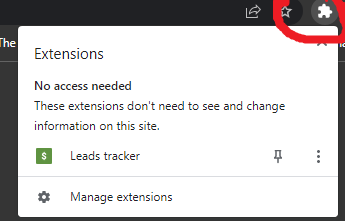

# RENDER/LINK SAVER EXTENSION

- Just the same as bookmarking something but through extension

## ADD extension to browser

- Click the drop-down green button "CODE" then choose "Download zip"
- Once finish, unzip/extract it and choose your prefered directory
- Go to your browser extensions or paste this [chrome://extensions/](chrome://extensions/)
- At the top right turn on the developer mode
- Find the "Load unpacked" and click it
- Browse where did you save your unzip file and click this folder
<<<<<<< HEAD
- Once it show up, turn it on
- Then at the top right og your browser e.g chrome click the puzzle icon.The click the lead tracker
  
=======
- Once it shows up, turn it on
- Then at the top right of your browser e.g chrome click the puzzle icon.The click the lead tracker
  
>>>>>>> 443d47d98457484546c30758409d2e944b76c1ce

